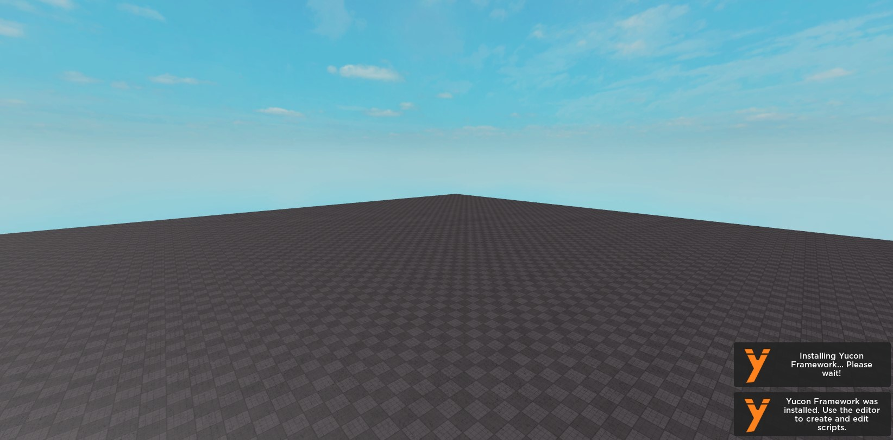
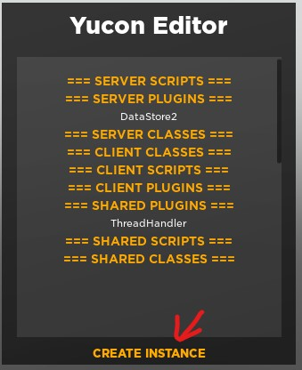
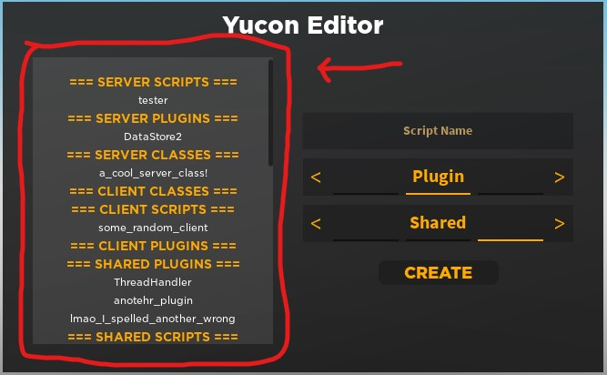
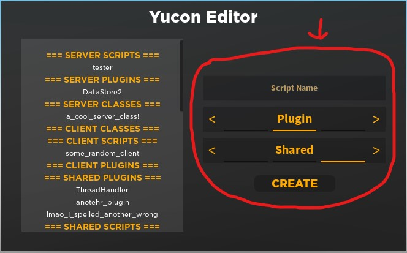

# Yucon Framework

### [API](API.md) | [LICENSE](https://raw.githubusercontent.com/iG-Studios/YuconFramework/main/LICENSE) | [DOWNLOAD](https://www.roblox.com/library/5196221650/Yucon-Framework) | [UPDATES](Updates.md)

---

Yucon Framework is a lightweight, organized, and secure framework that intends to run everything with best possible effenciency.

Code in Yucon is divided into three types of code: Scripts, Plugins, and Classes.
Scripts run on their own, while plugins and classes do not. All of the code has the Yucon API!

Scripts | Plugins | Classes |
------- | ------- | ------- |
Run entirely on their own like a standard Roblox script | Act like standard Roblox modules, returns userdata module | An OOP class that can be constructed with `self:NewInstance()`

The code is also divided between server, client, and shared code. Server and client code runs on their respective descriptions.
However, shared code is special, and shares the code between BOTH the server and client. Shared scripts, for example, run on both client and server!

Server | Client | Shared |
------ | ------ | ------ |
Runs exclusively on the server, not accessible by the client | Runs exclusively on the client, not accessible by the server | Runs on both client and server |

All code is communicative with each other, meaning you can access any script, plugin, or class api from any other Yucon instance.
This naturally reduces the amount of code you need to use, because instead of relying on events to pass data, you can directly modify that data.

Yucon Framework also encourages and integrates object-oriented programming, which allows for immense flexibility and security.

The framework is also covered [on the devforum](https://devforum.roblox.com/t/yucon-code-framework-keep-your-code-efficient-effective-and-organized/630895), if you prefer to read light information about it there.

# Installation to Studio
The installation page is found in the Roblox Library.
You may find the down link [here](https://www.roblox.com/library/5196221650/Yucon-Framework)

This will install a plugin into Roblox Studio. It will also require proper permissions to insert scripts in order for it to properly function.

You will only have to do this once per device.

When installed, you will see the following toolbar in your plugins:

# Installation to Game
Installing to a game is very simplistic.
Simply press *Import Framework* in the toolbar to import the framework.

> For the best organization and optimization, it is recommended you don't install Yucon Framework to existing games. However, it is entirely up to you.

Now that Yucon Framework is completely installed, we can get started on using it.

---

# Using Yucon Framework

There are three parts to the Framework: **Scripts**, **Plugins**, and **Classes**
You can manage them in a variety of ways with the Yucon Editor

## The Initial Menu
By default, Yucon opens into a collapsed mode that gives you direct access to existing instances, with a button that reads "New Instance" to expand the menu.
For the best experience, click this button.

## Using the Explorer
On the left, you can view existing scripts, plugins, and classes.
Clicking any of them will immediately open then in the script editor.

## Using the Instance Creator
The instance creator is how you create new instances.

You can:
* Choose the name
* Choose the parent/function
* Choose the style

Upon clicking "create," it'll create the instance, add it to the explorer, and open it immediately.

---

# API
Want to know how the functions inside Yucon work? Take a look at the [API](API.md)!
