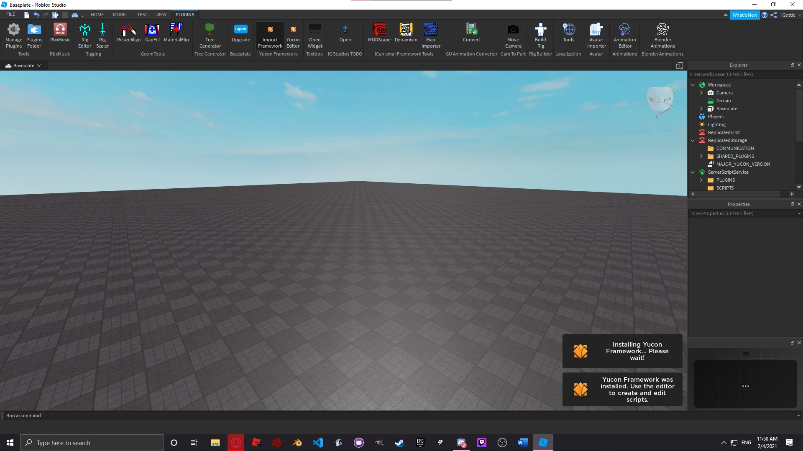
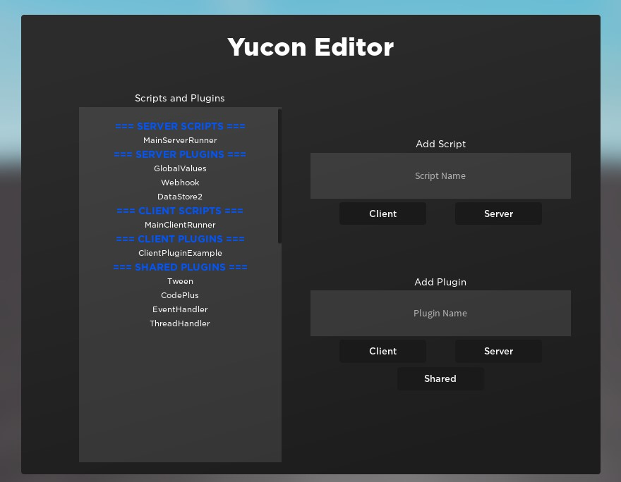
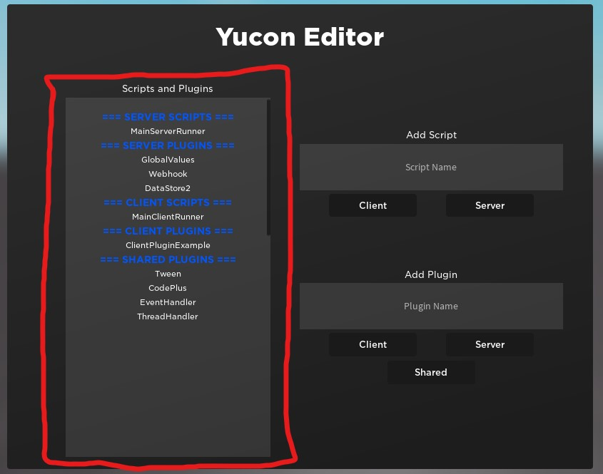
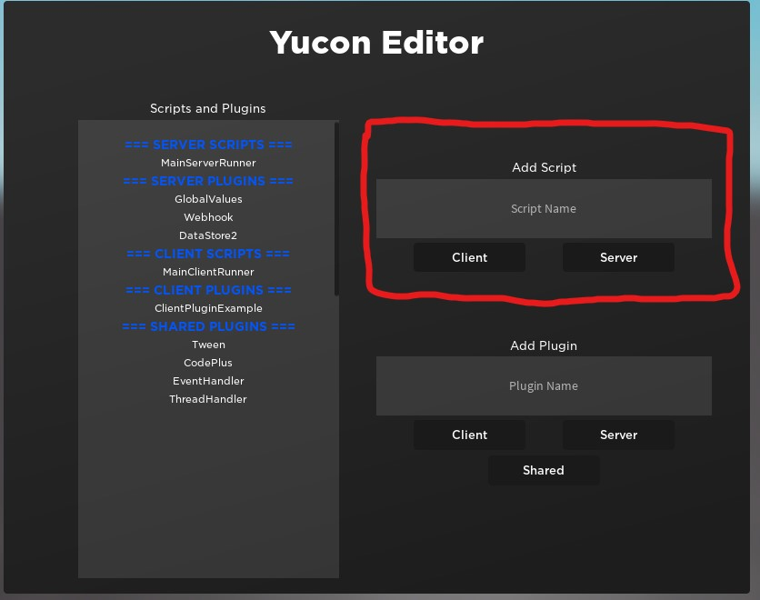
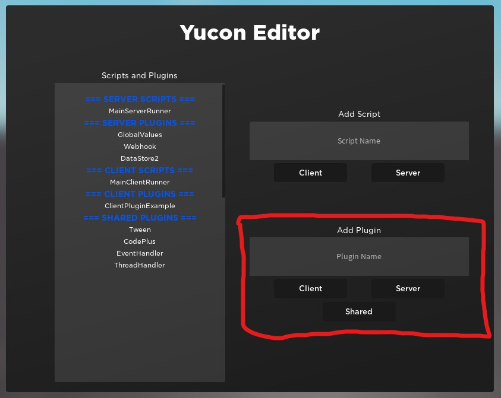

# Yucon Framework

Yucon Framework is a lightweight and organized framework. This is targeted towards those who want organized and optimized code.

The framework is also covered [on the devforum](https://devforum.roblox.com/t/yucon-code-framework-keep-your-code-efficient-effective-and-organized/630895), if you prefer to read light information about it there.

### [API](API.md) | [LICENSE](https://raw.githubusercontent.com/iG-Studios/YuconFramework/main/LICENSE) | [DOWNLOAD](https://www.roblox.com/library/5196221650/Yucon-Framework) | [UPDATES](Updates.md)

---

# Installation to Studio
The installation page is found in the Roblox Library.
You may find the down link [here](https://www.roblox.com/library/5196221650/Yucon-Framework)

This will install a plugin into Roblox Studio. It will also require proper permissions to insert scripts in order for it to properly function.

You will only have to do this once per device.

When installed, you will see the following toolbar in your plugins:

# Installation to Game
Installing to a game is very simplistic.
Simply press *Import Framework* in the toolbar to import the framework.

> For the best organization and optimization, it is recommended you don't install Yucon Framework to existing games. However, it is entirely up to you.

Now that Yucon Framework is completely installed, we can get started on using it.

---

# Using Yucon Framework

There are two aspects of the Framework: **Plugins and Scripts**

Scripts | Plugins
------- | -------
Run on their own | Do not run on theur own
Have many built-in functions | Have functionaly moreso determined by the developer
Work more like regular scripts/local scripts | Work more like module scripts

You can manage them in a variety of ways with the Yucon Editor

## Script Editing
In the left scrollable frame, you will see a list of scripts.

Clicking on a script name will open that script for you to edit.
Editing the code works just like editing code normally with Roblox.

> DO NOT REMOVE PRELOAD, START, STEP, OR RENDER METHODS FROM CODE.

## Adding a Script
You can add a script via the add-script textbox and buttons.
* Input a script name.
* Press either *Client* or *Server*
  * Pressing *Client* will create a client script, which will include the additional `Render` function.
  * Pressing *Server* will create a server script, which won't include the additional `Render` function.

## Adding a Plugin
You can add a plugin via the add-plugin textbox and buttons.
* Input a plugin name
* Press *Client*, *Server*, or *Shared*
  * Pressing *Client* or *Server* will make that plugin only usable on the client or server, respectively.
  * Pressing *Shared* will make the plugin usable by both the client and server. 

> Shared plugins DO NOT share changes in data, they only share the same base.

---

# API
Want to know how the functions inside Yucon work? Take a look at the [API](API.md)!
